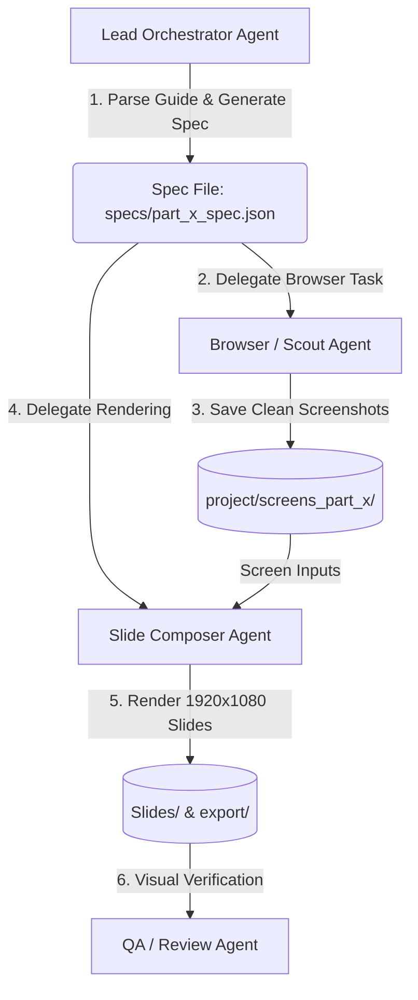

# Multi-Agent POS Slide Generation Skill

This skill defines the multi-agent workflow for transforming user guide manuals (e.g., `ISARVA-CG-001-Customer-User-Guide.pdf`) into presentation slides.

---

## 1. Multi-Agent Role Architecture



### Role 1: Lead Orchestrator Agent
- **Input**: User guide section (e.g., Part L, Part M, Part D) and POS application URL.
- **Responsibilities**:
  1. Reads the section text from `scratch/guide_pdf_full.txt` or `scratch_pdf_dump.txt`.
  2. Extracts:
     - Section Kicker (e.g. `PART L — SETTINGS > BUSINESS`)
     - Step Headings (e.g. `L1 — Company Details`)
     - "Where" location subheadings (e.g. `Where: Settings > Company Details`)
     - Step sequence (1, 2, 3...)
     - Any important notes or tips.
  3. Writes the structured specification file to `specs/part_<id>_spec.json`.
  4. Triggers or delegates the Browser and Composer agents.

### Role 2: Browser / Scout Agent (Playwright Navigation)
- **Tooling**: Playwright headless browser or `browser_subagent`.
- **Responsibilities**:
  1. Authenticates into POS (Terminal `C001`, User `admin`, PIN `0000`).
  2. Navigates to the respective module route for each step.
  3. Prepares pristine application state:
     - Clear search filters so items/tables are visible.
     - If empty states exist, click sample load buttons if available.
     - **CRITICAL**: Wait 3–4 seconds after page load or button click so all temporary toast alerts disappear.
  4. Captures full 1920x1080 screenshots into `project/screens_part_<id>/`.
  5. **GOLDEN RULE**: Screenshots must be 100% clean and authentic. **NEVER draw bounding boxes, highlights, arrows, or markings on the screenshot.**

### Role 3: Slide Composer Agent (Canvas & Typography)
- **Tooling**: PIL (Pillow), `src.screen_composer.compose_pc_screen`.
- **Responsibilities**:
  1. Loads transparent canvas background (`restaurant-app/Libraries/complete-design-format/Only-background-transparent.png`).
  2. Mounts the captured screenshot into the PC monitor frame (`restaurant-app/Libraries/Parts/PC-Screen.png`) at `(60, 175)`.
  3. Typesets text column at `X = 1148`:
     - Kicker: `Rubik-SemiBold`, 20pt, Blue (`#1271D0`).
     - Heading: `Rubik-SemiBold`, 38pt, Dark (`#232323`).
     - Where: `Rubik-Regular`, 20pt, Gray (`#58585A`).
     - Number Badges: 28px diameter circle in `#1271D0` with centered white bold text.
     - Step Text: `Rubik-Regular`, 19pt, Dark (`#232323`).
  4. Replaces Unicode arrows (`→`) with `>` to avoid missing font glyph boxes.
  5. Exports high-res JPEGs to both `Slides/<Part>/` and `export/<Part>/`.

### Role 4: Quality Auditor Agent (Visual Review)
- **Tooling**: `view_file` on output slides.
- **Responsibilities**:
  1. Verifies that the screen inside the monitor is crisp and completely unannotated.
  2. Checks that text does not collide or wrap awkwardly.
  3. Confirms all step numbers and text match the user guide manual.

---

## 2. Specification Protocol (`specs/part_<id>_spec.json`)

Any agent can define or modify slide sets using this schema:

```json
{
  "part_id": "L",
  "part_title": "PART L — SETTINGS > BUSINESS",
  "output_dir": "Part L",
  "slides": [
    {
      "step_id": "L1",
      "filename": "L1 - Company Details.jpg",
      "heading": "L1 — Company Details",
      "where": "Where: Settings > Company Details",
      "note": "Do this first after you Activate POS.",
      "steps": [
        "Open Company Details.",
        "Enter restaurant brand name and legal name.",
        "Enter VAT / tax number and address carefully.",
        "Add or edit Branches (each outlet).",
        "Save.",
        "On the till top bar, select the branch you are working on."
      ],
      "target_route": "/settings/company",
      "actions": [],
      "screen_filename": "L1_company_details.jpg"
    }
  ]
}
```

---

## 3. Pipeline Execution Runbook

### Option A: Complete Automated Pipeline (CLI)
Run the orchestrator with both capture and render:
```powershell
uv run --with playwright --with pillow python scripts/pipeline/orchestrator.py --spec specs/part_l_spec.json
```

### Option B: Render Only (When Screenshots Already Exist)
```powershell
uv run --with pillow python scripts/pipeline/orchestrator.py --spec specs/part_l_spec.json --no-capture
```

### Option C: Python Modular API
```python
from scripts.pipeline.orchestrator import run_pipeline

# Execute end-to-end for any specification
run_pipeline(
    spec_path="specs/part_l_spec.json",
    capture=True,   # Launches Browser Agent
    render=True     # Launches Composer Agent
)
```

---

## 4. Multi-Agent Dispatch Prompt Templates

When delegating tasks across subagents, use these prompt structures:

### Prompt to Browser Subagent:
```text
Task: Capture clean screenshots for POS User Guide Part <ID>
Spec Path: specs/part_<id>_spec.json
Output Directory: project/screens_part_<id>/
Requirements:
1. Log in using terminal C001, username admin, PIN 0000.
2. For each slide in the spec, navigate to target_route.
3. Wait for all toast banners to disappear (at least 3 seconds).
4. Save clean 1920x1080 screenshot without any markings, highlights, or bounding boxes.
```

### Prompt to Composer Subagent:
```text
Task: Render brand presentation slides for POS User Guide Part <ID>
Spec Path: specs/part_<id>_spec.json
Screens Directory: project/screens_part_<id>/
Output Locations: Slides/<Part>/ and export/<Part>/
Requirements:
1. Embed screens into PC-Screen.png mockup.
2. Use Rubik typography with #1271D0 circular number badges.
3. Replace unicode arrows with '>' to ensure clean rendering.
4. Verify all slides are exported at 1920x1080.
```
