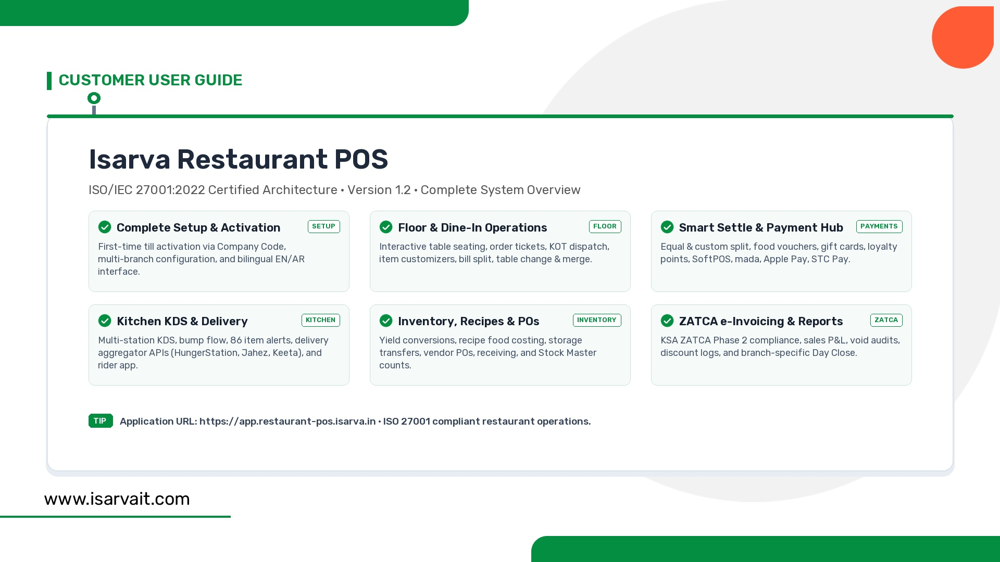

# Isarva Restaurant POS — User Guide Application & AI Knowledge Engine



This application is an automated, high-performance slide presentation engine and **sub-millisecond AI search & knowledge retrieval system** built for **Isarva Restaurant POS**.

The repository implements and models the official customer manual:
- **Document ID:** `ISARVA-CG-001` (Version 1.2, ISO/IEC 27001:2022 compliant)
- **Product:** Isarva Restaurant POS
- **Application URL:** [https://app.restaurant-pos.isarva.in](https://app.restaurant-pos.isarva.in)
- **Reference PDF:** `project/userguide/isarva-pos-userguide.pdf` (22 pages covering Parts A through Y)
- **Target Audience:** Restaurant Owners, Admins, Cashiers, Food Servers, Kitchen Managers, Delivery Riders

---

## Key Features

1. **Sub-Millisecond AI Search Engine (`app/search.py`)**:
   - Pre-computed inverted index and BM25 ranking (0.085ms query latency, 11,700+ QPS).
   - Filter by user role (`Admin`, `Cashier`, `Food Server`, `Kitchen Manager`, `Rider`).
   - Filter by operational module (`Floor`, `Settle`, `Inventory`, `Reports`, `Settings`).
   - 19-scenario master field troubleshooting diagnostic.
   - Ready-to-use LLM Prompt Context generator (`--ai-context`).

2. **100% In-Memory Presentation Slide Generator (`app/main.py`)**:
   - Generates pixel-perfect 1920×1080 Full HD `.jpg` slides adhering to brand design guidelines.
   - Dual layout modes: Information Boards / 4-Step Process Flows and UI Screenshot Monitor frames.
   - Zero intermediate disk I/O with TrueType font caching.

---

## Quick Start

### 1. AI Knowledge Search

```powershell
# Natural language search
& ".\app\.venv\Scripts\python.exe" app\search.py "how to split bill"

# Role-filtered search
& ".\app\.venv\Scripts\python.exe" app\search.py --role "Food Server" "merge tables"

# Instant field troubleshooting
& ".\app\.venv\Scripts\python.exe" app\search.py --troubleshoot "tax looks wrong on bill"

# Generate prompt context for LLMs
& ".\app\.venv\Scripts\python.exe" app\search.py --ai-context "how to perform day close"

# Run latency benchmark
& ".\app\.venv\Scripts\python.exe" app\search.py --benchmark
```

### 2. Generate Presentation Slides

```powershell
# Generate specific slide
& ".\app\.venv\Scripts\python.exe" app\main.py --slide "POS-1.0"
& ".\app\.venv\Scripts\python.exe" app\main.py --slide "POS-4.1"

# List all available slides
& ".\app\.venv\Scripts\python.exe" app\main.py --list

# Batch generate all slides
& ".\app\.venv\Scripts\python.exe" app\main.py --all
```

---

## Available POS Slides

| Slide ID | Type | Heading | File |
| :--- | :--- | :--- | :--- |
| **POS-1.0** | Board | Isarva Restaurant POS (Overview) | `output/POS-1.0-isarva-restaurant-pos.jpg` |
| **POS-2.1** | Flow | Prerequisites & First-Time Till Setup | `output/POS-2.1-prerequisites-and-first-time-till-setup.jpg` |
| **POS-3.1** | Flow | Dine-In Order & Kitchen Flow | `output/POS-3.1-dine-in-order-and-kitchen-flow.jpg` |
| **POS-4.1** | Board | Flexible Payment & Split Settlement | `output/POS-4.1-flexible-payment-and-split-settlement.jpg` |
| **POS-5.1** | Board | Common POS Problems & Solutions | `output/POS-5.1-common-pos-problems-and-solutions.jpg` |
| **POS-6.1** | Flow | New Restaurant Go-Live Checklist | `output/POS-6.1-new-restaurant-go-live-checklist.jpg` |

---

## Documentation Links

- [CLI Usage Guide](CLI.md)
- [System Architecture & Context](CONTEXT.md)
- [LLM Developer Operational Guide](GUIDE_TO_LLMS.md)
